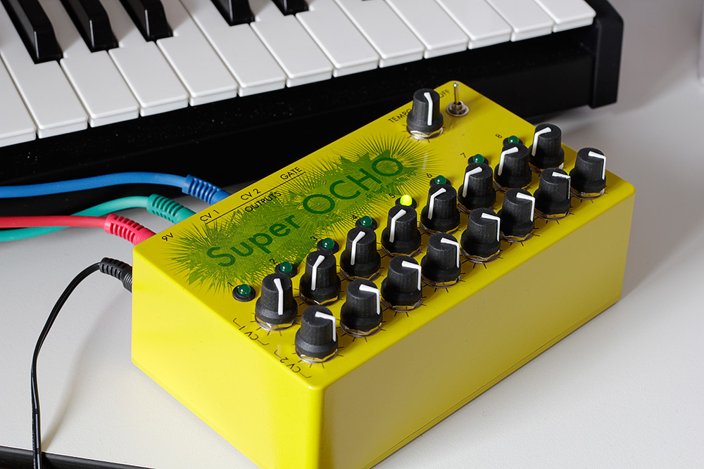
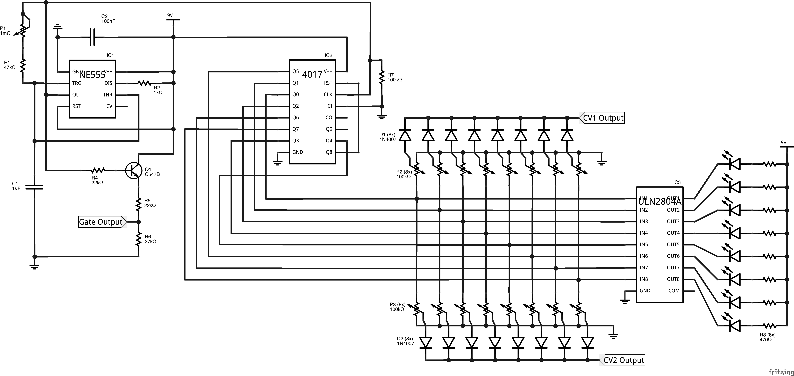
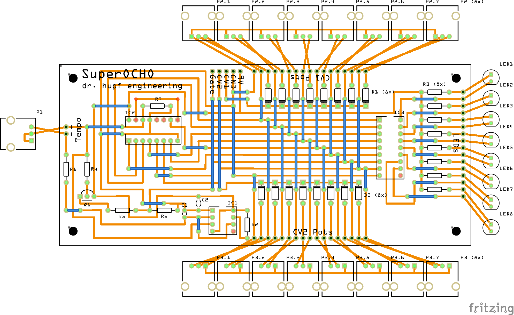
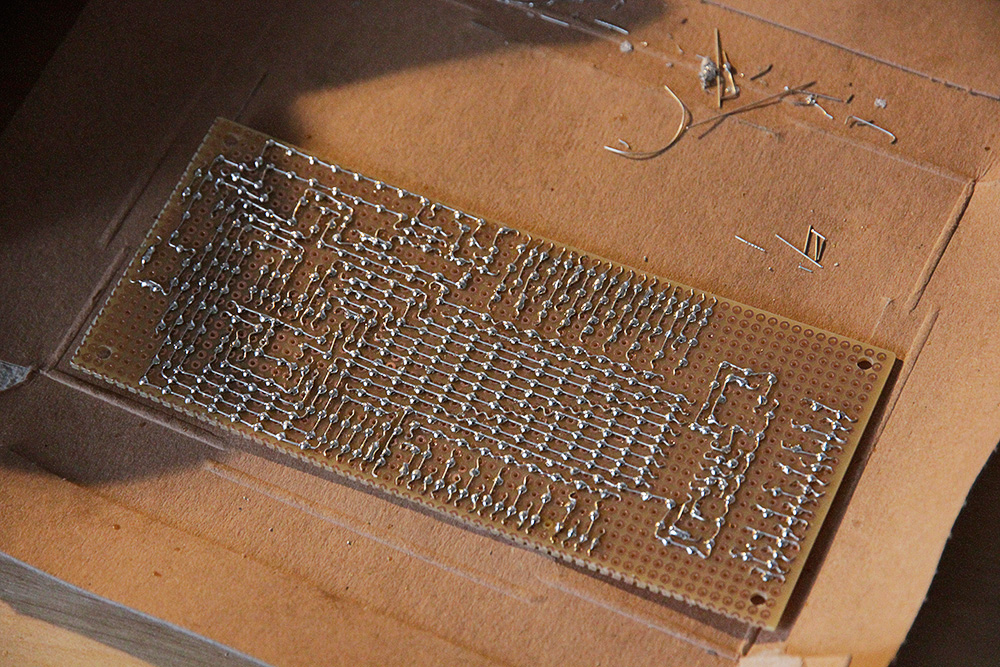
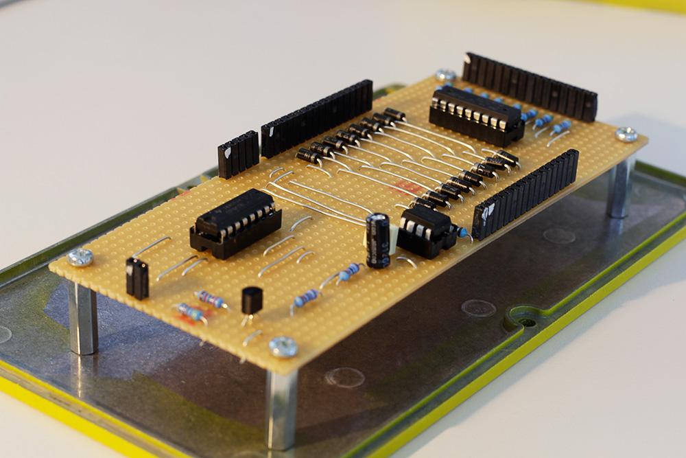
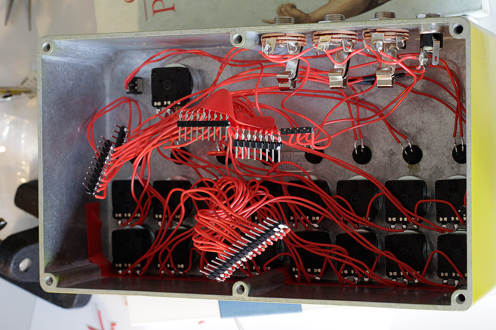

# Super OCHO #

An 8-Step analog sequencer with a Gate and two seperate CV outputs.

The sequencer circuit is inspired by [captain's analog Baby 10 sequencer](http://static.flickr.com/107/309524222_7dee86bda1_b.jpg) that uses a 4017 decade counter IC. For the clock it uses a [timer circuit described on elektronik-kompendium.de](http://www.elektronik-kompendium.de/sites/praxis/bausatz_taktgenerator-mit-lmc555cn.htm), based on a NE555 timer IC.

The panel design graphic included in the repository fits on a Hammond Electronics 1590R1 case. It can be [applied to the case](http://www.youtube.com/watch?v=e2X_HL-4F90) using [waterslide decal](http://www.amazon.de/gp/product/B007Y52LKQ/).

## Schematic ##

## PCB ##

The following circuit is designed to be soldered onto a Euro strip board. There are very good instructions by Bernhard Redemann on how to do this (in German): [Professionelles Löten von Lochrasterplatinen](http://www.b-redemann.de/download/loeten.pdf)

## Images ##

The soldered bottom side of the board:

The finished board:

The equipped case and the wirings:

